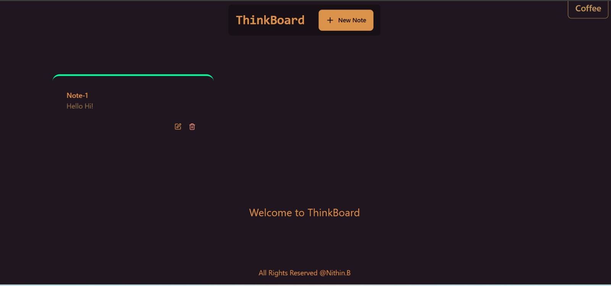
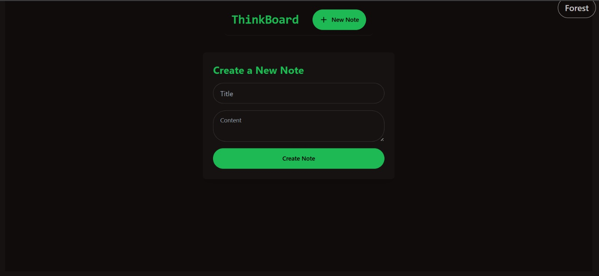

#  ThinkBoard

**ThinkBoard** is a **MERN stack web application** that allows users to create and manage boards for organizing tasks, notes, and ideas.  
It provides an intuitive interface with drag-and-drop functionality and persistent data storage using MongoDB.  

---

## Features

-  Create and manage multiple boards  
-  Add, edit, and delete tasks  
-  Drag-and-drop tasks between columns   
-  Persistent data with MongoDB  
-  Full-stack MERN architecture (MongoDB, Express, React, Node.js)  

---

##  Tech Stack

**Frontend**
- React (with Hooks / Context API if used)  
- Axios for API calls  
- CSS3 / TailwindCSS / Bootstrap  

**Backend**
- Node.js  
- Express.js  
- MongoDB with Mongoose  

**Other**
- JWT authentication (optional)  
- Local development setup  
---
## Screenshots




---
##  Project Structure
**ThinkBoard/**
```
│
├── backend/ # Express + MongoDB backend
│ ├── models/ # Database schemas
│ ├── routes/ # API routes
│ ├── controllers/ # Logic for handling requests
│ ├── server.js # Backend entry point
│ └── package.json
│
├── frontend/ # React frontend
│ ├── src/ # Components, pages, utilities
│ ├── public/ # Static assets
│ └── package.json
│
└── README.md
```
